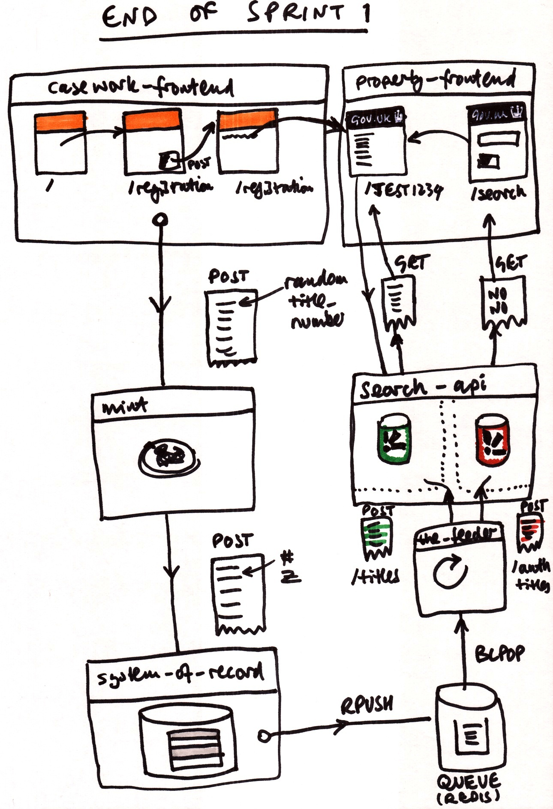

# Sprint 1

Drawings and other artefacts to explain the architecture of the concept during sprint 1.

## Vision

### Public title

### Private title

### New title

### Feeder

### Search

### Data Migration

## Reality

© Crown copyright. All content is available under the [Open Government Licence v2.0](http://www.nationalarchives.gov.uk/doc/open-government-licence/version/2/), except where otherwise stated
